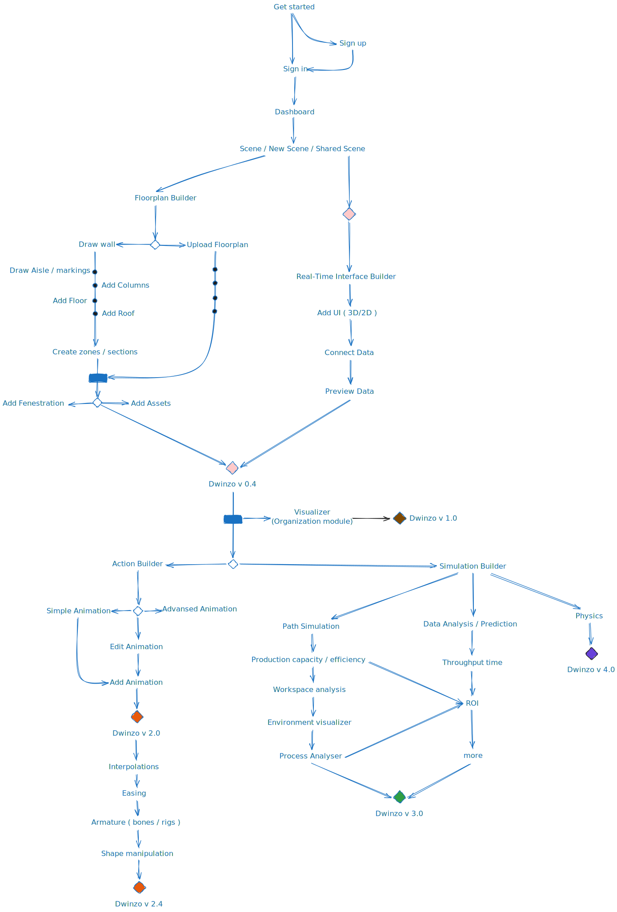

## Project Folder Structure

```plaintext
my-react-app/
├── .github/
│   └── workflows/                # CI/CD configuration (e.g., GitHub Actions)
│       └── ci.yml                # Configuration for automated tests/lints
├── .husky/                       # Husky Git hooks
│   ├── pre-commit                # Pre-commit hook for linting and tests
│   ├── pre-push                  # Pre-push hook for running tests
│   └── _/                        # Husky internal scripts
│       └── husky.sh              # Husky script
├── docs/                         # Documentation folder (for Docsify)
│   ├── _navbar.md                # Navigation configuration for Docsify
│   ├── documentation             # Documented contents
│   ├── _sidebar.md               # Sidebar configuration for Docsify
│   ├── .nojekyll                 # Skip Jekyll processing for GitHub Pages
│   ├── index.html                # Main landing page for Docsify
│   └── README.md                 # Documentation file
├── public/                       # Static public assets (e.g., index.html)
├── src/                          # Main source code
│   ├── assets/                   # Static assets (images, styles)
│   │   ├── fonts/                # Font files
│   │   ├── images/               # Image files
│   │   ├── models/               # 3d files (e.g., .gltf, .fbx)
│   │   └── styles/               # Global styles (SCSS)
│   │       ├── abstracts/        # SCSS variables, functions, and mixins
│   │       ├── base/             # Basic, global styles (e.g., resets)
│   │       ├── components/       # Styles specific to components
│   │       ├── layout/           # Layout-related styles (e.g., grid, flexbox)
│   │       ├── pages/            # Page-specific styles
│   │       └── main.scss         # Main SCSS entry file
│   ├── components/               # Reusable React components
│   │   ├── 3d-ui/                # 3d ui components (e.g., distance text)
│   │   ├── common/               # Shared/common components (e.g., buttons, inputs)
│   │   ├── layout/               # Layout-related components (e.g., header, footer)
│   │   ├── ui/                   # Ui-related components (e.g., toolbar, menu)
│   │   ├── templates/            # modals, loaders, skeletons
│   │   ├── temp/                 # temporary workspace (to try function/components without interfearing with app)
│   │   └── scene/                # all 3d realted functions.
│   ├── hooks/                    # Custom React hooks
│   ├── functions/                # Non-React utility functions
│   ├── pages/                    # Page components (e.g., Home, About)
│   ├── services/                 # API services and business logic
│   ├── store/                    # Global state management (e.g., Redux store)
│   ├── store/                    # Global state management (e.g., Redux store)
│   ├── temp/                     # temporary workspace (to try function/components without interfearing with app)
│   ├── tests/                    # Testing folder
│   │   ├── unit/                 # Unit tests
│   │   │   ├── __mocks__/        # Mock files for unit tests
│   │   │   ├── __tests__/        # Unit test files
│   │   │   ├── setupTests.ts     # Setup for Jest
│   │   │   └── jest.config.js    # Jest configuration
│   │   └── e2e/                  # End-to-end tests (Cypress)
│   │       ├── integration/      # Integration test files
│   │       ├── fixtures/         # Fixtures for mock data in tests
│   │       ├── plugins/          # Cypress plugins
│   │       ├── support/          # Cypress support files (e.g., commands)
│   │       └── cypress.config.js # Cypress configuration
│   ├── utils/                    # Utility functions/helpers (independent functions)
│   ├── app.tsx                   # Root React component
│   ├── index.tsx                 # Main entry point for React application
│   └── react-app-env.d.ts        # TypeScript environment types for React
├── .env                          # Environment variables (e.g., API keys)
├── .eslintrc.js                  # ESLint configuration for code linting
├── .gitignore                    # Files and directories to be ignored by Git
├── package.json                  # Project dependencies and scripts
├── tsconfig.json                 # TypeScript configuration
└── README.md                     # Project documentation (this file)
```

## Planed Project Flow

<p align="center">
  
</p>

## Google Documents Links

1. 📄 [Factory Builder Feature explanation](https://docs.google.com/document/d/1yDu-kfRFhQVOx2ydcaaA5nZJ3itdc6JKa9SU7wlXGUU/edit?tab=t.0)

2. 📄 [Real-Time Visualization Editor](https://docs.google.com/document/d/1DVkM2h1KVYorbUUtSHDBbSyGkwel-Z-TX6nT9pHLs1o/edit?tab=t.0#heading=h.s6jrhhnl6xzz)

3. 📄 [Action Builder](https://docs.google.com/document/d/1q-vzbUcH5K2sDOm-Aiw0jJ4QYYP6wT4MXXGs2UKQqBs/edit?tab=t.0#heading=h.h5m0upm9zsk9)

4. 📄 [MarketPlace Modelling Documentation](https://docs.google.com/document/d/1I7pCqVlCODtThqipb_wWGG5vP0_Hc_xZQQIqoD4bN-w/edit?tab=t.0)

5. 📄 [Component : Outliner](https://docs.google.com/document/d/1EeKPSCYBY9rB9V7glZWpI5C0iJDn25yb4yTHRG2AFzE/edit?tab=t.0)

## Refrence videos

1. This video offers a preview of a conceptual project created entirely with Figma and Blender based on previous version of this project (Dwinzo).

<video controls style="max-width: 100%; height: auto;">
  <source src="../assets/videos/dwinzo_version-0.0-refrence/walkthrough.mp4" type="video/mp4">
  Your browser does not support the video tag.
</video>
